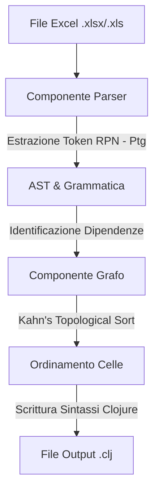

# Efesto  

**E**xcel **F**ormula **E**xtractor **S**ystem and **T**opological **O**rdering algorithm (Sistema di **E**strazione delle **F**ormule da **E**xcel e algoritmo di **O**rdinamento **T**opologico).

## Contesto
Basato sulla revisione personale della grammatica di Excel pubblicata nell'articolo:
*"A Grammar for Spreadsheet Formulas Evaluated on Two Large Datasets"* di Efthimia Aivaloglou, David Hoepelman e Felienne Hermans.

---

## Architettura e Documentazione del Progetto

**Efesto** è un transpilatore Java progettato per estrarre formule da fogli di calcolo Excel (tramite la libreria Apache POI), analizzarne le dipendenze e transpilarle in espressioni funzionali equivalenti in linguaggio **Clojure**.

Il progetto implementa un parser completo di formule Excel, costruisce un grafo orientato delle dipendenze tra celle ed esegue un ordinamento topologico per garantire che le definizioni delle variabili in Clojure avvengano nell'ordine corretto di valutazione.

### 1. Requisiti di Sistema, Versioni Java e JDK

Dal punto di vista della configurazione del compilatore e delle dipendenze, il progetto è configurato come segue:

* **Versione Java (Language Level)**: **JDK 15**
  Il codice sorgente fa uso di funzionalità del linguaggio fino a Java 15 (es. *Text Blocks* tramite le triple virgolette `"""`).
* **JDK di Build / Runtime**: **OpenJDK 19**
* **Jakarta EE**: **Versione 9** (API compatibili con `jakarta.*`)
  Configurato all'interno dell'IDE (IntelliJ IDEA) come JDK del progetto (`openjdk-19`).
* **Librerie di Terze Parti (Dipendenze)**:
  * **Apache POI 4.1.1** (`poi-4.1.1`): Utilizzata per la lettura a basso livello dei file Excel `.xlsx` e `.xls`, l'estrazione delle formule e il parsing dei token in formato RPN (Notazione Polacca Inversa).
  * **JUnit 5 (5.4.2 & 5.8.1)**: Utilizzata per la suite di test automatici dell'applicazione.

---

### 2. Architettura del Progetto

L'architettura di Efesto è suddivisa in tre macro-componenti principali che cooperano per completare la transpilazione:



#### 2.1 Componente Parser (`com.trueprogramming.excel.excel.parser`)
Gestisce l'interfacciamento con i file Excel e il parsing della sintassi delle formule.
* **`AbstractParser`**: Classe astratta di base. Apre il foglio di calcolo Excel tramite Apache POI (`WorkbookFactory.create`), itera tra i fogli di lavoro (`Sheet`), le righe (`Row`) e le singole celle (`Cell`). Fornisce i metodi per mappare i riferimenti di cella e leggere i valori grezzi.
* **`Parser`**: Esegue l'analisi sintattica reale delle formule. Per ogni cella contenente una formula, estrae i token a basso livello espressi in Notazione Polacca Inversa (RPN, rappresentati dalla classe `Ptg` di POI). Utilizza uno stack (`Stack<Start>`) per convertire la sequenza di token RPN nei corrispondenti nodi dell'Abstract Syntax Tree (AST).
* **`BuiltinFactory`**: Factory deputata all'istanziazione dinamica dei nodi dell'AST relativi alle funzioni predefinite di Excel (es. `SUM`, `AVERAGE`, `ABS`, `IF`, ecc.) in base al loro nome e arità.

#### 2.2 Componente Grammatica e AST (`com.trueprogramming.excel.excel.grammar`)
Definisce la struttura dell'Abstract Syntax Tree (AST) utilizzato per modellare la grammatica delle formule Excel e convertirle in codice Clojure funzionale.
* **`grammar.lexicaltokens` (Terminali)**: Modella i nodi foglia dell'AST:
  * `CELL`: Riferimento a una cella (es. `A1`).
  * `RANGE`: Riferimento a un intervallo di celle (es. `A1:B3`).
  * `FLOAT`, `INT`: Costanti numeriche.
  * `TEXT`: Stringhe testuali.
  * `BOOL`: Valori booleani (`TRUE` / `FALSE`).
  * `ERROR`, `ERRORREF`: Errori nativi di Excel (es. `#REF!`, `#DIV/0!`).
* **`grammar.nonterm` (Non Terminali)**: Modella i costrutti sintattici complessi:
  * `Start`: Il punto di ingresso che incapsula le coordinate di cella (`row`, `column`, `sheetName`) e la formula associata.
  * `Formula`: Interfaccia o classe base per tutte le sotto-formule.
  * `ParenthesisFormula`: Formule racchiuse tra parentesi tonde `( Formula )`.
  * `ConstantArray`: Matrici costanti definite all'interno delle formule (es. `{1;2;3}`).
* **`grammar.nonterm.binary` & `grammar.nonterm.unary` (Operatori)**:
  * Modella operazioni binarie (+, -, \*, /, ^, =, <>, <, >, <=, >=, &) ed espressioni unarie (+, -, %).
* **`grammar.functions` (Funzioni)**:
  * Modella funzioni Excel built-in e funzioni di riferimento come `OFFSET`, `INDEX`, `INDIRECT`.

Ogni classe all'interno dell'AST implementa il metodo `toString()`, che si occupa della generazione del rispettivo codice Clojure (ad esempio, l'operatore binario `Add` traduce `A1 + B1` in `(+ A1 B1)`).

#### 2.3 Componente Grafo (`com.trueprogramming.excel.excel.graph`)
Risolve il problema dell'ordine di valutazione delle celle all'interno di un linguaggio di programmazione funzionale (dove ogni variabile deve essere definita prima di poter essere utilizzata).
* **`Node` & `Edge`**: Modellano i nodi (celle/formule) e gli archi orientati (le dipendenze). Se la formula nella cella `C1` fa riferimento a `A1` e `B1`, verranno creati due archi orientati: `A1 -> C1` e `B1 -> C1`.
* **`StartGraph`**: Gestisce il grafo orientato aciclico (DAG). Implementa l'algoritmo di **ordinamento topologico di Kahn** (`topologicalSort()`).
  * Trova tutti i nodi senza archi entranti (le celle con costanti o formule indipendenti) e li inserisce in una coda.
  * Rimuove progressivamente i nodi dalla coda e aggiorna il grafo rimuovendo i rispettivi archi uscenti, inserendo i nodi che rimangono senza dipendenze nella coda.
  * Se al termine rimangono degli archi nel grafo, viene segnalato un errore di riferimento circolare.

#### 2.4 Entry Point (`com.trueprogramming.excel.excel`)
* **`ToolkitCommand`**: Classe orchestratrice principale. Esegue la scansione e il parsing del file Excel, invoca l'ordinamento topologico sul grafo delle dipendenze, e scrive il file di output finale. Genera per ogni cella la sintassi di definizione Clojure nella forma:
  ```clojure
  (def NomeCella EspressioneClojure)
  ```
* **`ToolkitOptions`**: Fornisce le opzioni di configurazione per il tool (es. modalità dettagliata / verbose).

---

### 3. Grammatica BNF e Regole di Transpilazione

Di seguito sono riportate le corrispondenze tra la grammatica Excel BNF supportata da Efesto e la rispettiva traduzione Clojure generata dal transpilatore.

#### 3.1 Costanti
* **Numeri**: In Excel tutti i numeri vengono convertiti e gestiti internamente come numeri in virgola mobile (`FLOAT`).
  * *Excel*: `10` o `10.5` $\rightarrow$ *Clojure*: `10.0` o `10.5`
* **Testo**:
  * *Excel*: `"Hello"` $\rightarrow$ *Clojure*: `"Hello"`
* **Booleani**:
  * *Excel*: `TRUE` / `FALSE` $\rightarrow$ *Clojure*: `Boolean/TRUE` / `Boolean/FALSE` (usando le costanti booleane di Java interfacciate in Clojure).
* **Date (DATETIME)**:
  * Excel memorizza le date internamente come numeri seriali. Efesto intercetta questa proprietà di formattazione e transpila la data in un oggetto `java.time.LocalDate`:
  * *Excel*: `01-02-2018` $\rightarrow$ *Clojure*: `(java.time.LocalDate/parse "2018-02-01")`

#### 3.2 Operatori Binari e Unari
| Operazione Excel | Token Grammatica | Traduzione Clojure | Esempio Excel | Esempio Clojure |
| :--- | :--- | :--- | :--- | :--- |
| Addizione | `⟨Formula⟩+⟨Formula⟩` | `(+ a b)` | `A1 + B1` | `(+ A1 B1)` |
| Sottrazione | `⟨Formula⟩-⟨Formula⟩` | `(- a b)` | `A1 - B1` | `(- A1 B1)` |
| Moltiplicazione | `⟨Formula⟩*⟨Formula⟩` | `(* a b)` | `A1 * B1` | `(* A1 B1)` |
| Divisione | `⟨Formula⟩/⟨Formula⟩` | `(/ a b)` | `A1 / B1` | `(/ A1 B1)` |
| Minore / Maggiore | `<` / `>` | `(< a b)` / `(> a b)` | `A1 < B1` | `(< A1 B1)` |
| Uguaglianza | `=` | `(= a b)` | `A1 = B1` | `(= A1 B1)` |
| Disuguaglianza | `<>` | `(not= a b)` | `A1 <> B1` | `(not= A1 B1)` |
| Concatenazione | `&` | `(str a b)` | `A1 & " test"` | `(str A1 " test")` |
| Potenza | `^` | `(Math/pow a b)` | `A1 ^ 2` | `(Math/pow A1 2.0)` |
| Negativo (Unario) | `-⟨Formula⟩` | `(- a)` | `-A1` | `(- A1)` |
| Percentuale | `⟨Formula⟩%` | `(/ a 100.0)` | `A1%` | `(/ A1 100.0)` |

#### 3.3 Funzioni Built-in e Riferimenti
* **Riferimenti a intervalli (Range)**:
  Un intervallo come `A1:A3` viene mappato in un vettore Clojure contenente i valori estratti dalle celle.
  * *Excel*: `A1:A3` $\rightarrow$ *Clojure*: `[valoreA1 valoreA2 valoreA3]`
* **Funzione SUM su intervalli**:
  Tradotta in un'operazione di `reduce` con l'operatore di addizione:
  * *Excel*: `SUM(A1:A3)` $\rightarrow$ *Clojure*: `(reduce + A1:A3)`
* **Funzione IF**:
  Tradotta direttamente nell'espressione condizionale `if` nativa di Clojure:
  * *Excel*: `IF(A1>10, B1, C1)` $\rightarrow$ *Clojure*: `(if (> A1 10.0) B1 C1)`
* **Nomi di cella con foglio multiplo**:
  Se il foglio di calcolo ha più schede, i nomi delle variabili Clojure includono il nome del foglio per evitare collisioni:
  * *Excel*: `Foglio1!A1` $\rightarrow$ *Clojure*: `Foglio1!A1` (carattere `!` ammesso come nome valido in Clojure).
  * *Excel con spazi*: `'Dati Vendite'!A1` $\rightarrow$ *Clojure*: `'Dati Vendite'!A1`.

---

## Altri Documenti
* **Sintassi BNF Completa**: [Grammar](doc/Grammar.md)
* **Algoritmo di Parsing e Esempi**: [Algorithm](doc/Algorithm.md)

---

## Licenza
Tutti i file di **Efesto** sono rilasciati sotto la licenza **AGPL Versione 3.0**.
Se i termini della licenza AGPL Versione 3.0 sono incompatibili con le proprie necessità di utilizzo di Efesto, sono disponibili termini di licenza alternativi contattando direttamente Massimo Caliman all'indirizzo email mcaliman@gmail.com per qualsiasi richiesta di licenza commerciale o di terze parti.
